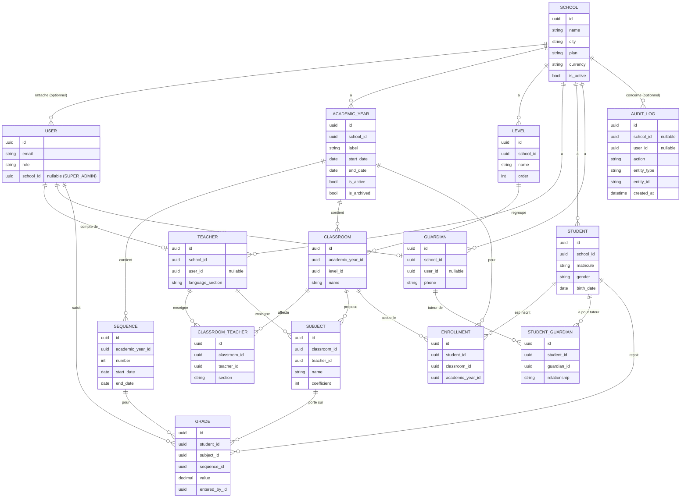

# Modèle de données — SCRUM-7

Ce document décrit les modèles Django posés par le ticket SCRUM-7 : socle
multi-tenant, utilisateurs, calendrier scolaire, structure (niveaux,
classes, matières), personnes (élèves, enseignants, parents) et notes.
Il ne couvre ni l'API, ni l'authentification, ni les calculs de moyennes
(voir « Règles de calcul à valider par l'équipe » ci-dessous).

## Socle multi-tenant

Chaque école (`tenants.School`) est un tenant isolé. La plupart des
modèles métier héritent de `core.TenantModel`, qui ajoute :

- une clé primaire UUID et un horodatage (`created_at`/`updated_at`),
  via `core.TimeStampedModel` ;
- un champ `school` obligatoire, indexé, en `on_delete=PROTECT` ;
- une vérification générique dans `clean()` : toute clé étrangère locale
  pointant vers un autre `TenantModel` doit référencer un objet de la
  **même** école (sinon `ValidationError`) ;
- `save()` qui appelle systématiquement `full_clean()` avant d'écrire en
  base, afin que ces invariants soient garantis quel que soit le point
  d'entrée (API, shell Django, script de seed).

Les clés étrangères vers `accounts.User` (qui n'est pas un `TenantModel`,
car un `SUPER_ADMIN` n'a pas d'école) sont vérifiées explicitement dans
le `clean()` de chaque modèle concerné (`Teacher.user`, `Guardian.user`,
`Grade.entered_by`).

Les contraintes de base de données (unicité, `CHECK`, `ExclusionConstraint`
PostgreSQL) restent le dernier garde-fou, notamment pour les écritures qui
contournent `save()` (ex. `bulk_create`).

## Diagramme entité-relation

## Description des modèles

### `tenants.School`

Le tenant. N'hérite pas de `TenantModel` (c'est la racine). `plan`
(STARTER/STANDARD/PREMIUM) ne fait qu'étiqueter l'école pour l'instant :
les quotas associés seront appliqués par un service dédié plus tard.

### `accounts.User`

Utilisateur personnalisé (`AbstractBaseUser` + `PermissionsMixin`),
connexion par email. `role` détermine le type de compte (`SUPER_ADMIN`,
`SCHOOL_ADMIN`, `TEACHER`, `PARENT`, `CASHIER`). Un `SUPER_ADMIN` n'a
jamais d'école (`school` nul) ; tous les autres rôles en ont une
(contrainte `CHECK` en base). L'email est normalisé en minuscules et son
unicité est **globale** et insensible à la casse (contrainte sur
`Lower(email)`).

### `core.AuditLog`

Journal d'audit en ajout seulement (`save()`/`delete()` refusent toute
modification ou suppression d'une entrée existante). L'écriture
automatique depuis les vues/services viendra avec les tickets suivants.
`metadata` ne doit jamais contenir de secrets ni de données personnelles
superflues.

### Calendrier : `academics.AcademicYear` / `academics.Sequence`

Une année scolaire par école, avec au plus une année active à la fois
(contrainte d'unicité partielle). Les séquences (1 à 6) appartiennent à
une année et ne peuvent pas se chevaucher entre elles, ni les années
entre elles, au sein d'une même école — via des `ExclusionConstraint`
PostgreSQL sur `daterange(start_date, end_date, '[]')` (nécessite
l'extension `btree_gist`, activée par la migration). Le trimestre
(`Sequence.trimester`) est une propriété calculée (`(numéro + 1) // 2`),
jamais stockée.

### Structure : `academics.Level` / `Classroom` / `Teacher` /
`ClassroomTeacher` / `Subject`

- `Level` : niveau scolaire (CP1…CM2, personnalisable), unique par école
  (nom et ordre).
- `Classroom` : une classe pour une année scolaire et un niveau donnés.
- `Teacher` : profil enseignant, avec un compte `User` optionnel
  (`role=TEACHER`, même école) et une section linguistique (FR/EN).
- `ClassroomTeacher` : affectation d'un enseignant à une classe pour une
  section donnée (au plus un enseignant par section et par classe ; un
  enseignant n'est affecté qu'une fois par classe). La règle « exactement
  un enseignant FR et un EN par classe » est une règle de *complétude*,
  vérifiée par un service plus tard, pas par une contrainte.
- `Subject` : matière propre à une classe, rattachée à un enseignant qui
  doit être affecté à cette classe via `ClassroomTeacher` (vérifié dans
  `clean()`).

### Personnes : `Student` / `Enrollment` / `Guardian` / `StudentGuardian`

- `Student` n'a **pas** de clé étrangère vers `Classroom` : l'affectation
  passe par `Enrollment`, qui lie un élève, une classe et une année
  scolaire (un élève n'a qu'une classe par année). `Enrollment.save()`
  aligne automatiquement `academic_year` sur celui de la classe.
- `Guardian` modélise un parent/tuteur, avec un compte `User` optionnel
  (`role=PARENT`, même école). `StudentGuardian` relie élèves et tuteurs
  (plusieurs tuteurs par élève, plusieurs élèves par tuteur), avec un lien
  de parenté optionnel.

### `grades.Grade`

Une note par élève/matière/séquence (0 à 20, deux décimales). `clean()`
vérifie que la séquence appartient à l'année scolaire de la classe de la
matière, que l'élève est inscrit dans cette classe pour cette année, et
que l'auteur de la saisie (`entered_by`) appartient à la même école (ou
est `SUPER_ADMIN`). **Moyennes, rangs et appréciations sont calculés,
jamais stockés.**

## Modèles prévus (hors de ce ticket)

- **Finance** : configuration des frais de scolarité (`FeeConfig`,
  incluant la pension — volontairement absente de `Classroom`), échéances,
  paiements, reçus.
- **Workflow des notes** : état de saisie/validation par séquence et par
  classe, verrouillage après validation.
- **Bulletins** : génération PDF, agrégation des moyennes/rangs/
  appréciations par séquence/trimestre/année.
- **Absences** : présence, justificatifs, notifications aux parents.
- **Communications** : messages, annonces, notifications (email/SMS) vers
  le personnel et les parents.

## Décisions et écarts par rapport au cahier des charges

- **`Enrollment` au lieu de `Student.classe_id`** : un élève change de
  classe chaque année ; une FK directe aurait empêché de conserver
  l'historique des années précédentes.
- **`ClassroomTeacher` au lieu de `Teacher.classe_id`** : un enseignant
  peut être affecté à plusieurs classes (et une classe a deux
  enseignants, FR et EN) ; une FK directe sur `Teacher` ne le permettrait
  pas.
- **Un seul compte `User` plus un profil (`Guardian`/`Teacher`)** plutôt
  que des champs d'authentification dupliqués sur chaque profil métier.
- **La pension n'est portée par aucun modèle de ce ticket** : elle ira
  dans la future `FeeConfig`, pas sur `Classroom`.
- **Clés primaires UUID** partout (plutôt que des entiers auto-incrémentés)
  pour éviter de fuiter un ordre/volume d'inscription et simplifier une
  éventuelle réplication multi-région plus tard.
- **Email unique globalement** (pas par école) : un même compte ne peut
  pas être réutilisé en plusieurs écoles, ce qui simplifie l'authentification
  (SCRUM-8) en évitant toute ambiguïté sur le tenant au login.
- **Montants en entiers FCFA** (`Teacher.monthly_salary`) : pas de
  décimales pour une devise qui n'en utilise pas.
- **Séquences avec trimestre calculé**, jamais stocké, pour éviter toute
  incohérence si le découpage venait à changer.

## Règles de calcul à valider par l'équipe (non implémentées)

Ces règles ne sont **pas** codées dans ce ticket ; elles sont consignées
ici pour validation avant implémentation (service de calcul dédié) :

- **Moyenne de séquence** = Σ(note × coefficient) ÷ Σ(coefficients des
  matières notées).
- **Moyenne de trimestre** = moyenne de ses deux séquences.
- **Moyenne annuelle** = moyenne des séquences.
- **Rang** = ordre décroissant de la moyenne au sein de la classe.
- **Seuils des appréciations** (ex. « Excellent », « Encourageant »,
  « Insuffisant ») : à définir avec l'équipe pédagogique.
